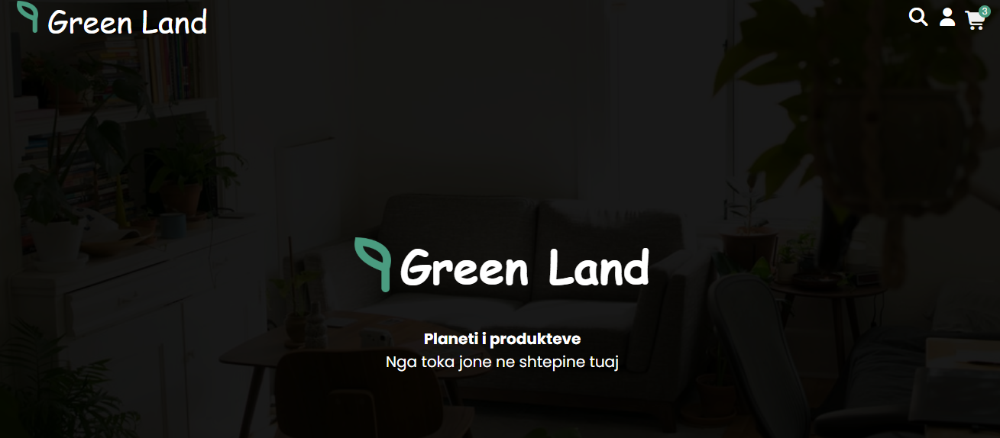
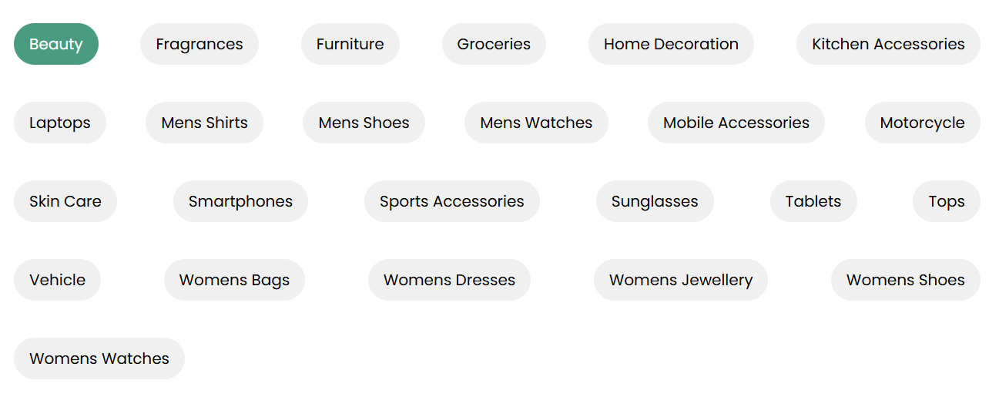
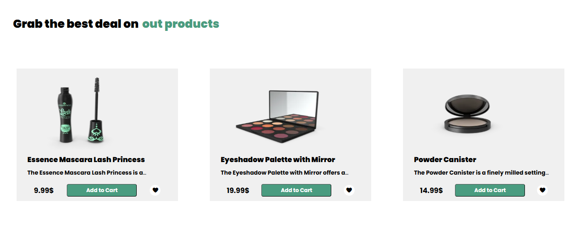
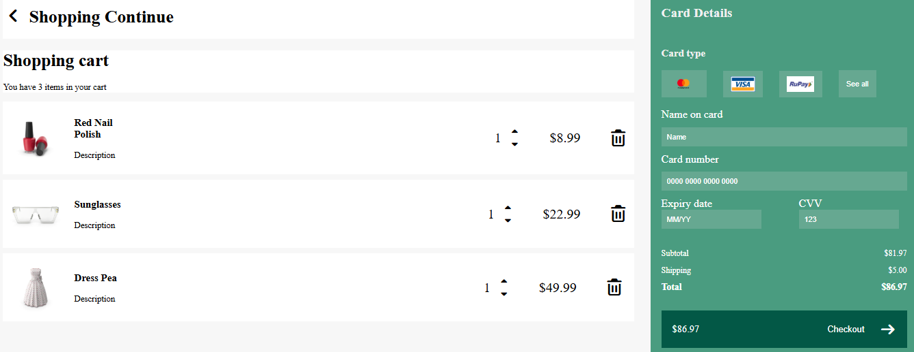

# Green Land

**Green Land** është një dyqan online që ofron produkte nga natyra dhe kategori të ndryshme si: Premium Fruits, Home & Kitchen, Fashion, Electronics dhe Beauty. Projekti përdor **HTML, CSS dhe JavaScript**.

---
## Live Demo
👉 https://green-land-bay.vercel.app/index.html

## Karakteristikat Kryesore
- Faqe kryesore me hero section dhe kategori produktesh.  
- Filtrim i produkteve sipas kategorive.  
- Shopping Cart interaktiv me mundësi për të ndryshuar sasinë e artikujve dhe për t’i hequr.  
- Formular pagesash me input për kartat.  
- Notifikime vizuale me **Toastify**.  
- Ikona dhe dizajn modern me **Font Awesome** dhe Google Fonts.

---

##  Screenshots

### Faqja Kryesore

### Shopping Cart

---

## 🛠 Teknologjitë e Përdorura
- HTML5  
- CSS3  
- JavaScript  
- Toastify.js  
- Font Awesome  

---

##  Si ta shikosh projektin
1. Hap `index.html` në shfletues për faqen kryesore.  
2. Hap `shoppingList.html` për karrocën dhe funksionalitetet.

